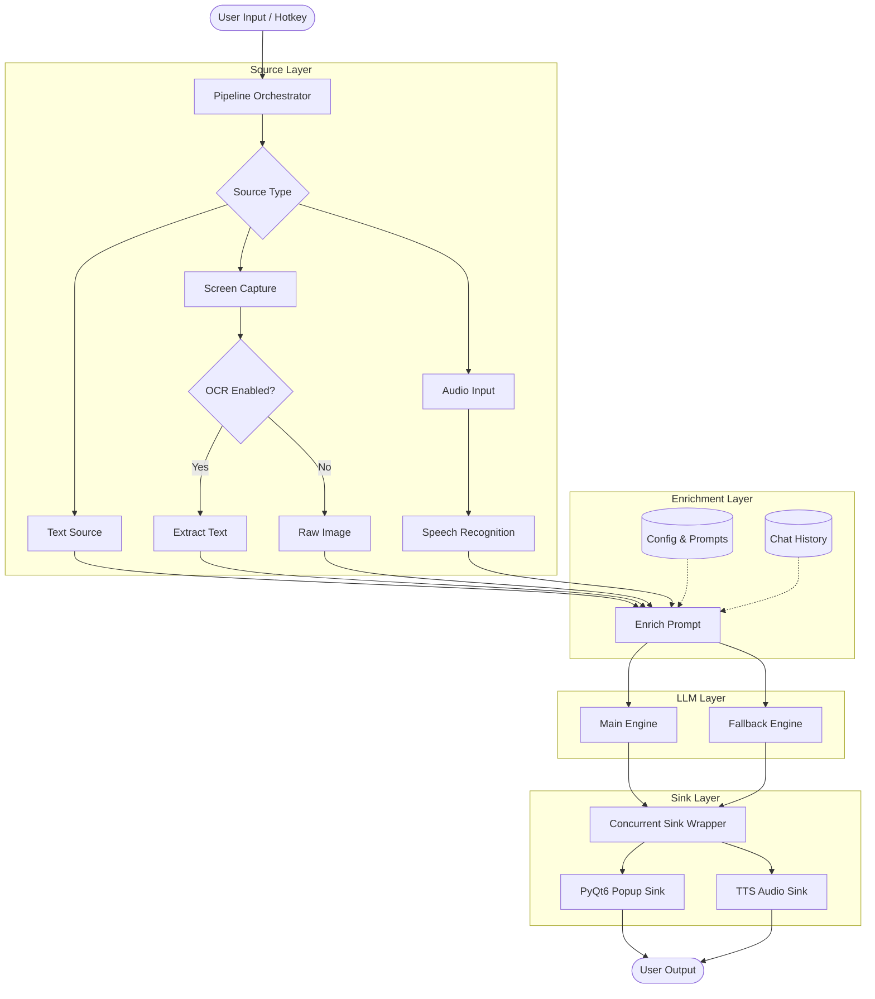
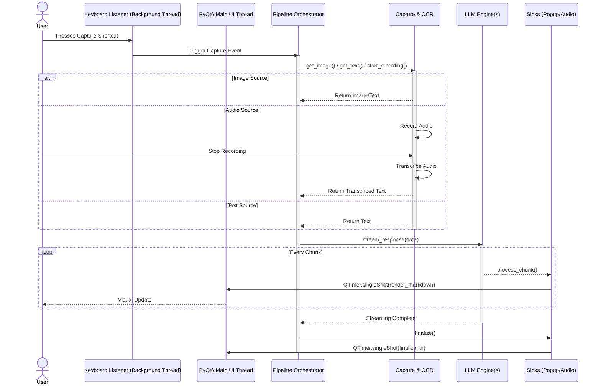

# Architecture Overview

This project is structured around a flexible, decoupled pipeline that flows from data extraction to text generation and finally to user presentation.

The primary pipeline follows this sequence: **Source -> Enrich Prompt -> LLM Engine -> Response Sink**.

### High-Level Architecture Flowchart

### Execution Sequence Diagram

## 1. Source (`core/sources/`)
The Source is responsible for capturing the initial raw data.
*   **Multiple Source Types:**
    *   **TextSource:** Direct text input from the control panel.
    *   **ScreenshotSource:** Screen capture using coordinate selection.
    *   **SoundSource:** Audio recording with speech recognition.
*   **OCR Integration (`core/sources/ocr/`):** If a local OCR engine (like PaddleOCR) or remote OCR service is configured, the pipeline attempts to extract text via the source's `get_text()` method.
*   **Speech Recognition:** The SoundSource uses Google Speech-to-Text to transcribe audio input in real-time.
*   If OCR is disabled or fails, the pipeline falls back to capturing the raw image (`get_image()`), provided the downstream LLM engine supports multimodal inputs.
*   Image OCR extraction is optimized to run only once, regardless of how many LLM models are running concurrently.
*   Audio recording runs in a background thread to avoid blocking the UI during capture.

## 2. Enrich Prompt
Before sending data to the LLM, the application enriches the prompt:
*   **System Prompts:** Specific instructions dictating the structure and tone of the response are appended (configured via `config/prompts.json`).
*   **Chat Session History:** Context from previous queries is retrieved (via `core.session_manager.SessionManager`) and injected. Depending on the engine, this is either stitched directly into the user prompt string (e.g., Ollama) or passed as structured context objects (e.g., Google GenAI API).

## 3. LLM Engine (`core/llm/`)
The Engine layer handles communication with the AI models.
*   **Supported Engines:** `GoogleGenAIEngine`, `GeminiCLIEngine`, and `OllamaEngine`.
*   **Concurrency (`ConcurrentSinkWrapper`):** The architecture supports running a primary model and a fallback model concurrently using threading.
    *   Both models are warmed up upon application startup.
    *   If the fallback model begins generating first, its output is streamed to the user.
    *   If and when the main model responds, the fallback's output is abruptly replaced by the primary model's superior response.
*   **Streaming:** Engines process responses in chunks, yielding them to the Sink layer line-by-line to enable real-time UI updates.

## 4. Response Sink (`core/sinks/`)
The Sink layer is responsible for taking the generated text and presenting it to the user.
*   **Popup Sink:** Streams the text directly into a PyQt6 QTextEdit widget (`ui/`). It implements a lightweight Markdown parser to natively render bold text, bullet points, markdown tables, and syntax-highlighted code blocks dynamically as chunks arrive.
*   **Audio Sink:** A separate daemon thread runs Piper TTS to read the completed response aloud without blocking the UI.

## Directory Structure
*   `core/`: Contains the main logic, including the pipeline orchestrator, sources, llm engines, and sinks.
    *   `sources/`: Input sources (text, screenshot, sound) and OCR engines.
    *   `llm/`: LLM engine implementations (Gemini CLI, Google GenAI, Ollama).
    *   `sinks/`: Output sinks (popup, audio, composite).
    *   `pipeline/`: Pipeline orchestration and processing logic.
*   `ui/`: Contains the PyQt6 GUI logic, control panels, configuration UI, popup notifications, and coordinate selection overlays.
*   `config/`: Manages configuration files (`config.json`, `profiles.json`, `prompts.json`), dynamic profile switching, and prompt definitions.
*   `services/`: Contains service implementations like the remote OCR service.
*   `sessions/`: Stores serialized JSON files representing the chat history of previous sessions.
*   `tests/`: Contains test suites.
    *   `e2e/`: End-to-end tests for automated UI interaction testing.
    *   `sanity/`: Standalone sanity check scripts for component verification.

## Threading & UI State
*   **PyQt6 Event Loop:** The UI runs in a persistent background thread (`QApplication.exec()`).
*   **Thread Safety:** Because global hotkeys (via the `keyboard` module) run in their own threads, all UI updates triggered by hotkeys or incoming LLM streams are dispatched safely back to the main UI thread using `QTimer.singleShot()` or Qt signals/slots.
