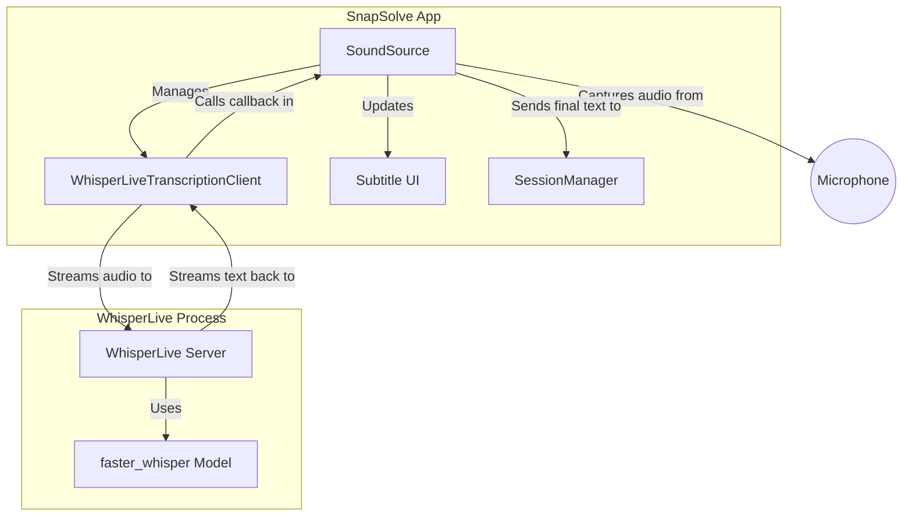
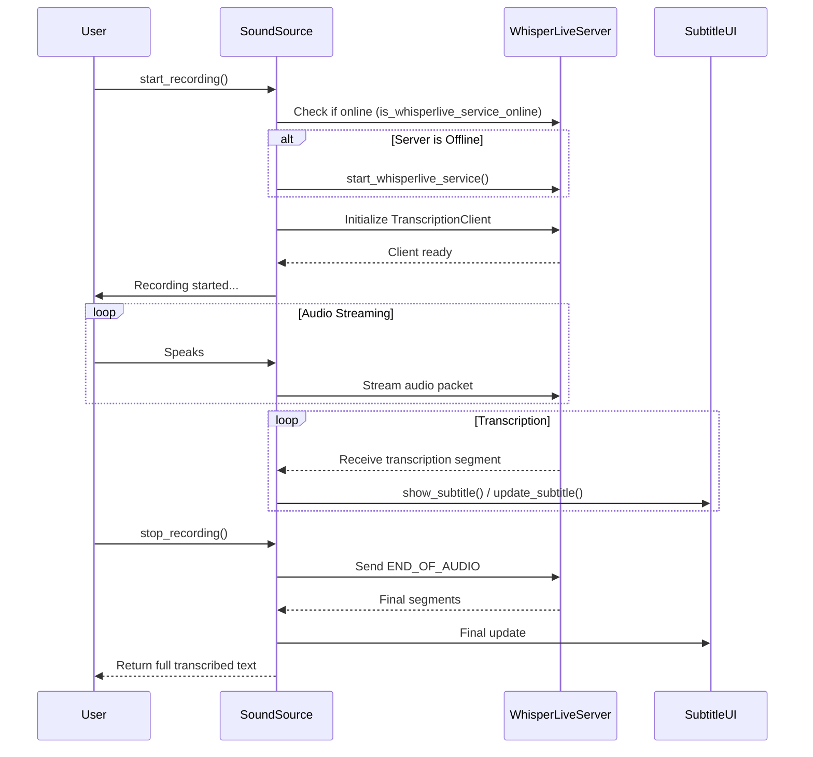

# Real-time Transcription Implementation in SnapSolve

This document outlines how real-time transcription is implemented in SnapSolve using [WhisperLive](https://github.com/collabora/WhisperLive).

## Setup & Installation

Due to compatibility issues with PyTorch, it is recommended to create a separate virtual environment (`venv`) inside the WhisperLive directory.

1. Create and activate a new virtual environment inside your WhisperLive directory.
2. Install the necessary packages:
   ```bash
   pip install torch torchvision torchaudio --index-url https://download.pytorch.org/whl/cu129
   pip install fastapi uvicorn faster_whisper websockets
   ```

## Overview

Real-time transcription is achieved by running a local instance of the WhisperLive server and connecting to it via a WebSocket client. Audio from the microphone is continuously streamed to the server, which returns real-time transcriptions that are displayed as subtitles on the screen and eventually appended to the session.

## Architecture

The transcription process involves several components working together. `SoundSource` acts as the central orchestrator within the main application, managing the `WhisperLive` server process and the client that communicates with it.



## Sequence of Events

The following diagram illustrates the sequence of events from the user starting a recording to receiving the final transcription.



## Implementation Details in `SoundSource`

The implementation handles the transcription through the `SoundSource` class:

### 1. Server Management
To ensure the service is available:
*   **Health Check:** `is_whisperlive_service_online()` checks if port `9090` is open.
*   **Starting the Service:** `start_whisperlive_service()` spawns a subprocess running `run_server.py` with `faster_whisper` as the backend.
*   **Warmup:** The `warmup()` method ensures the service is started and given time to load the model before any recording begins. This prevents long delays when the user starts speaking.
*   **Cleanup:** The `__del__` method ensures the subprocess is terminated when the app exits.

### 2. Client Initialization
When recording starts (`_record_and_transcribe_worker`):
1.  It verifies the service is online, attempting to start it if it isn't.
2.  It initializes a `WhisperLiveTranscriptionClient`, connecting to `localhost:9090`.
3.  It specifies settings like `no_speech_thresh=0.4` to handle silence detection appropriately.
4.  It sets `self._on_transcription_result` as the callback function to receive data.
5.  It waits for the `client.recording` state to be true before capturing audio.

### 3. Audio Streaming
Audio streaming runs continuously until `_stop_event` is set:
*   It captures audio chunks using `speech_recognition` (`pyaudio`).
*   It normalizes the raw PCM data to float32 values between -1.0 and 1.0.
*   WhisperLive expects 16kHz audio. If the microphone uses a different sample rate, the audio is resampled using `resampy`.
*   The processed byte array is sent using `client.send_packet_to_server()`.

### 4. Handling Results
The `_on_transcription_result` callback handles the text streams:
*   It tracks `_last_segment_start` to determine if a segment is new or an update to an existing utterance.
*   New segments trigger `show_subtitle(text)` and append previous finalized text.
*   Updates to the current segment trigger `update_subtitle(text, append=False)`.
*   When recording stops, a final `END_OF_AUDIO` signal is sent. The final string is then returned and optionally added to the chat session (`SessionManager`).

---

## E2E Testing (`tests/e2e/`)

The end-to-end tests provide comprehensive validation of the real-time transcription system through automated UI interaction.

### Test Structure

The E2E test suite consists of several key components:

#### Main Test File (`tests.py`)
- `test_audio_record()` - Tests basic audio recording with speech recognition
- `test_audio_transcription()` - Tests real-time WhisperLive transcription
- `test_text_source()` - Tests text input and TTS functionality
- `test_image_source()` - Tests image capture and OCR integration

#### Utility Modules
- `audio_utils.py` - Audio recording and TTS synthesis utilities
- `config.py` - Centralized configuration for test parameters
- `ui_utils.py` - UI interaction utilities using PyAutoGUI
- `network_utils.py` - Network and port checking utilities
- `process_utils.py` - Process management and cleanup

### How E2E Tests Test WhisperLive

#### 1. Audio Recording Test (`test_audio_record`)
This test validates the basic audio recording functionality:

**Test Flow:**
1. **UI Navigation**: Cycles through input sources until the record button is visible
2. **Recording Start**: Holds down the record button to begin audio capture
3. **Audio Input**: Uses TTS to speak a test question ("What is the fifth largest country in the world?")
4. **Recording Stop**: Releases the record button to end audio capture
5. **Verification**: Checks if the expected target word ("Brazil") appears in the transcribed text

**Key Features Tested:**
- Audio device selection and initialization
- Real-time audio capture from microphone
- Speech recognition accuracy
- UI integration and feedback

#### 2. Audio Transcription Test (`test_audio_transcription`)
This test specifically validates the real-time WhisperLive transcription system:

**Test Flow:**
1. **Service Activation**: Clicks the record button to start WhisperLive transcription
2. **Audio Generation**: Uses TTS to speak a test question with specific instructions
3. **Real-time Processing**: The system streams audio to WhisperLive and displays live transcription
4. **Result Verification**: Checks if the expected target word appears in the transcribed text
5. **Cleanup**: Stops the recording and verifies proper cleanup

**Key Features Tested:**
- WhisperLive service availability and connectivity
- Real-time audio streaming to transcription server
- Live subtitle display and updates
- Transcription accuracy and completeness
- Proper service shutdown and cleanup

#### 3. Audio Utilities (`audio_utils.py`)

**TTS Synthesis (`speak` function):**
- Uses PiperVoice for high-quality text-to-speech synthesis
- Supports custom output device selection (e.g., virtual audio cables)
- Creates temporary WAV files for robust playback
- Handles device discovery and fallback to default devices

**Audio Recording (`record_audio_in_background` function):**
- Continuous background audio recording using threading
- Supports custom device selection by name
- Captures audio data in real-time for later processing
- Integrates with speech recognition for validation

**Device Discovery (`get_microphone_index` function):**
- Searches available audio devices by name
- Returns device index for programmatic access
- Provides detailed error messages for device not found scenarios

### Configuration

The E2E tests use centralized configuration in `config.py`:

**Audio Devices:**
- `TTS_INPUT_DEVICE_NAME` - Virtual cable output for TTS testing
- `TTS_OUTPUT_DEVICE_NAME` - Virtual cable input for TTS playback
- `AUDIO_INPUT_DEVICE_NAME` - Input device for speech recognition

**Test Parameters:**
- `BASIC_QUESTION` - Test question for basic functionality
- `TARGET_WORD_BASIC` - Expected answer ("Brazil")
- `TARGET_WORD_PROGRAMMING` - Expected programming answer ("class")

**UI Coordinates:**
- `PROMPT_X, PROMPT_Y` - Position for text input
- `POPUP_X, POPUP_Y` - Position for response verification

### Running E2E Tests

```bash
cd tests/e2e
python tests.py
```

**Emergency Exit:** Press `Ctrl+Shift+Alt+Q` at any time to stop tests and clean up processes.

### Test Results Tracking

The E2E test suite maintains detailed test results:

- `test_text_source` - Text input and basic functionality
- `test_tts` - Text-to-speech synthesis
- `test_audio_record` - Audio recording with speech recognition
- `test_audio_transcription` - Real-time WhisperLive transcription
- `test_capture` - Single image capture
- `test_multi_capture` - Multi-select image capture

Results are displayed with status indicators (✅ PASSED, ❌ FAILED, ❓ NOT_RUN) and summary statistics.

---

## Feature Comparison: test_sound.py vs E2E Tests

### test_sound.py Features
- **Isolated Testing**: Standalone PyQt6 window for focused testing
- **Manual Control**: User-initiated tests with visual feedback
- **Device Selection**: Dropdowns for input/output device selection
- **Volume Monitoring**: Real-time audio level visualization
- **TTS Integration**: Piper TTS for consistent test audio generation
- **Synchronization**: Threading events for precise timing control
- **Detailed Verification**: Text normalization and comparison algorithms

### E2E Test Features
- **Automated UI**: PyAutoGUI for automated application interaction
- **Integration Testing**: Full application workflow validation
- **Background Recording**: Threading for non-blocking audio capture
- **Service Management**: Automatic service startup and health checks
- **Result Tracking**: Comprehensive test result tracking and reporting
- **Emergency Controls**: Keyboard shortcuts for test interruption
- **Multi-modal Testing**: Tests text, audio, and image input sources

### Complementary Testing

Both test suites serve complementary purposes:

- **test_sound.py**: Ideal for development, debugging, and feature validation
- **E2E tests**: Essential for integration testing and regression testing on developer machines

The combination ensures both individual component reliability and overall system integrity.
