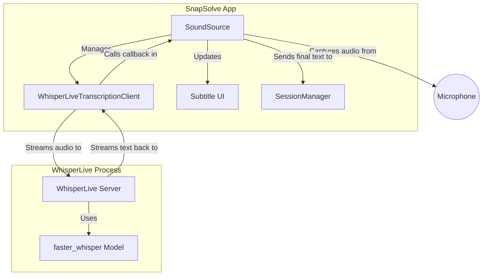
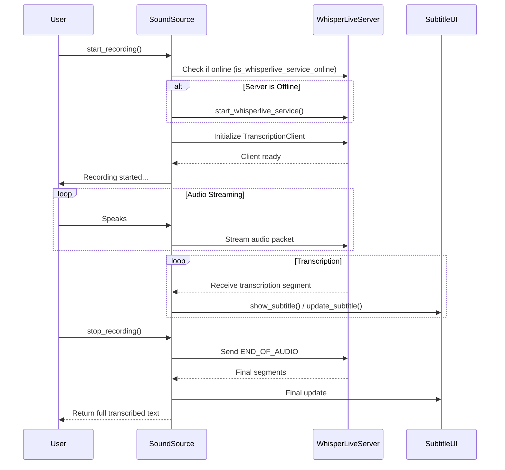

# Real-time Transcription Implementation in SnapSolve

This document outlines how real-time transcription is implemented in SnapSolve using [WhisperLive](https://github.com/collabora/WhisperLive).

## Overview

Real-time transcription is achieved by running a local instance of the WhisperLive server and connecting to it via a WebSocket client. Audio from the microphone is continuously streamed to the server, which returns real-time transcriptions that are displayed as subtitles on the screen and eventually appended to the session.

## Architecture

The transcription process involves several components working together. `SoundSource` acts as the central orchestrator within the main application, managing the `WhisperLive` server process and the client that communicates with it.

## Sequence of Events

The following diagram illustrates the sequence of events from the user starting a recording to receiving the final transcription.

## Implementation Details in `SoundSource`

The implementation handles the transcription through the `SoundSource` class:

### 1. Server Management
To ensure the service is available:
*   **Health Check:** `is_whisperlive_service_online()` checks if port `9090` is open.
*   **Starting the Service:** `start_whisperlive_service()` spawns a subprocess running `run_server.py` with `faster_whisper` as the backend.
*   **Warmup:** The `warmup()` method ensures the service is started and given time to load the model before any recording begins. This prevents long delays when the user starts speaking.
*   **Cleanup:** The `__del__` method ensures the subprocess is terminated when the app exits.

### 2. Client Initialization
When recording starts (`_record_and_transcribe_worker`):
1.  It verifies the service is online, attempting to start it if it isn't.
2.  It initializes a `WhisperLiveTranscriptionClient`, connecting to `localhost:9090`.
3.  It specifies settings like `no_speech_thresh=0.4` to handle silence detection appropriately.
4.  It sets `self._on_transcription_result` as the callback function to receive data.
5.  It waits for the `client.recording` state to be true before capturing audio.

### 3. Audio Streaming
Audio streaming runs continuously until `_stop_event` is set:
*   It captures audio chunks using `speech_recognition` (`pyaudio`).
*   It normalizes the raw PCM data to float32 values between -1.0 and 1.0.
*   WhisperLive expects 16kHz audio. If the microphone uses a different sample rate, the audio is resampled using `resampy`.
*   The processed byte array is sent using `client.send_packet_to_server()`.

### 4. Handling Results
The `_on_transcription_result` callback handles the text streams:
*   It tracks `_last_segment_start` to determine if a segment is new or an update to an existing utterance.
*   New segments trigger `show_subtitle(text)` and append previous finalized text.
*   Updates to the current segment trigger `update_subtitle(text, append=False)`.
*   When recording stops, a final `END_OF_AUDIO` signal is sent. The final string is then returned and optionally added to the chat session (`SessionManager`).

---

## Sanity Testing (`test_sound.py`)

The `tests/sanity/test_sound.py` script provides an isolated environment to verify that both normal recording and WhisperLive transcription work correctly.

### Features
It creates a standalone PyQt6 window with:
- Dropdowns to select Input and Output audio devices.
- Volume level monitoring.
- "Recording Test" (standard Google Speech Recognition).
- "Transcription Test" (Real-time WhisperLive).

### How it tests WhisperLive
When the "Transcription Test" button is clicked, it verifies the full pipeline:
1.  **Service Setup:** Similar to the main app, it checks if the service is running (`is_whisperlive_service_online()`) and starts it if necessary via a subprocess.
2.  **Audio Generation:** It reads a text block from the UI ("Text to Speak"). It uses `Piper TTS` to convert this text into an audio file (`test_output.wav`), ensuring consistent test data.
3.  **Synchronization:** It uses a `threading.Event` (`server_ready_event`) to ensure the WhisperLive client is fully connected and ready to receive data *before* it begins playing the generated audio.
4.  **Recording/Streaming:** It opens the selected microphone, reads the audio (which picks up the TTS playback from the speakers), resamples it if necessary, and streams it to the server.
5.  **Transcription Processing:** The `on_transcription_result` callback appends the recognized text to a string and displays it in the UI in real-time.
6.  **Verification:** Once playback finishes and the recording loop completes, `_compare_transcription_results()` is called. It normalizes both the original input text and the transcribed text, checking for an exact or partial match. This proves the system end-to-end: Audio Out -> Microphone In -> WhisperLive Server -> Parsed Result.
