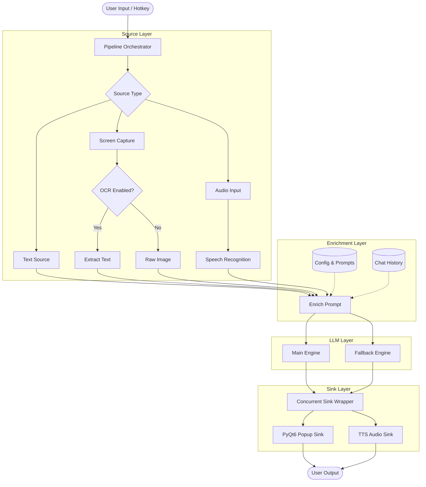
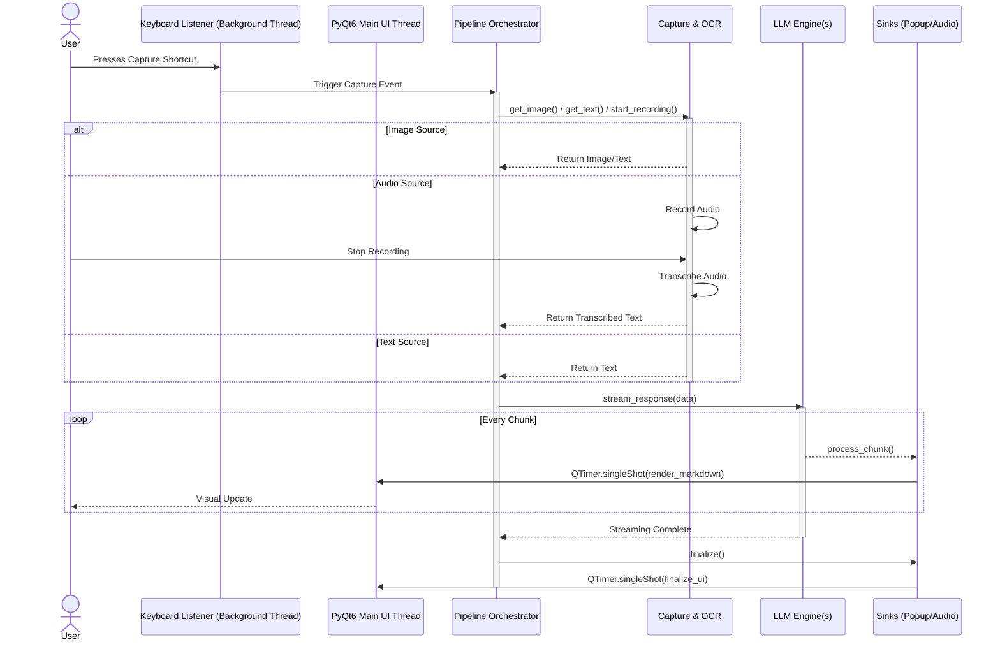

# Architecture Overview

This project is structured around a flexible, decoupled pipeline that flows from data extraction to text generation and finally to user presentation.

The primary pipeline follows this sequence: **Source -> Enrich Prompt -> LLM Engine -> Response Sink**.

### High-Level Architecture Flowchart

### Execution Sequence Diagram

## 1. Source (`core/sources/`)
The Source is responsible for capturing the initial raw data.
*   **Multiple Source Types:**
    *   **TextSource:** Direct text input from the control panel.
    *   **ScreenshotSource:** Screen capture using coordinate selection.
    *   **SoundSource:** Audio recording with speech recognition.
*   **OCR Integration (`core/sources/ocr/`):** If a local OCR engine (like PaddleOCR) or remote OCR service is configured, the pipeline attempts to extract text via the source's `get_text()` method.
*   **Speech Recognition:** The SoundSource uses Google Speech-to-Text to transcribe audio input in real-time.
*   If OCR is disabled or fails, the pipeline falls back to capturing the raw image (`get_image()`), provided the downstream LLM engine supports multimodal inputs.
*   Image OCR extraction is optimized to run only once, regardless of how many LLM models are running concurrently.
*   Audio recording runs in a background thread to avoid blocking the UI during capture.

## 2. Enrich Prompt
Before sending data to the LLM, the application enriches the prompt:
*   **System Prompts:** Specific instructions dictating the structure and tone of the response are appended (configured via `config/prompts.json`).
*   **Chat Session History:** Context from previous queries is retrieved (via `core.session_manager.SessionManager`) and injected. Depending on the engine, this is either stitched directly into the user prompt string (e.g., Ollama) or passed as structured context objects (e.g., Google GenAI API).

## 3. LLM Engine (`core/llm/`)
The Engine layer handles communication with the AI models.
*   **Supported Engines:** `GoogleGenAIEngine` (`google_genai.py`), `GeminiCLIEngine` (`gemini_cli.py`), and `OllamaEngine` (`ollama.py`).
*   **Concurrency (`ConcurrentSinkWrapper`):** The architecture supports running a primary model and a fallback model concurrently using threading.
    *   Both models are warmed up upon application startup.
    *   If the fallback model begins generating first, its output is streamed to the user.
    *   If and when the main model responds, the fallback's output is abruptly replaced by the primary model's superior response.
*   **Streaming:** Engines process responses in chunks, yielding them to the Sink layer line-by-line to enable real-time UI updates.

## 4. Response Sink (`core/sinks/`)
The Sink layer is responsible for taking the generated text and presenting it to the user.
*   **Popup Sink:** Renders the response using a PyQt6 `QWebEngineView` powered by `marked.js`, `KaTeX`, and `Mermaid.js` (`core/output.py`). This enables rich Markdown, LaTeX math, syntax-highlighted code blocks, and diagram rendering, with streaming updates as chunks arrive.
*   **Audio Sink:** A separate daemon thread runs Piper TTS to read the completed response aloud without blocking the UI.

## Directory Structure
*   `core/`: Contains the main logic.
    *   `output.py`: Central UI module (928 lines) — `PopupWidget`, `PanelWidget`, `TextInputWidget`, `SubtitleWidget`, `RecordButton`, `UIManager`, and `UISignals` for thread-safe communication.
    *   `session_manager.py`: Chat session persistence and history management.
    *   `remote_control_server.py`: HTTP server for Android remote control (mouse, actions).
    *   `sources/`: Input sources (`TextSource`, `ScreenshotSource`, `SoundSource`) and a `manager.py` singleton.
    *   `sources/ocr/`: OCR engines (`LocalPaddleOCREngine`, `RemotePaddleOCREngine`, `NoOCREngine`) with custom exception hierarchy.
    *   `llm/`: LLM engine implementations (`GoogleGenAIEngine`, `GeminiCLIEngine`, `OllamaEngine`).
    *   `sinks/`: Output sinks (`PopupSink`, `AudioSink`, `CompositeSink`).
    *   `pipeline/`: Pipeline orchestration (`process_pipeline()`) and `ConcurrentSinkWrapper` for fallback model concurrency.
*   `ui/`: PyQt6 dialog and overlay components.
    *   `config_ui.py`: Full configuration dialog (`ConfigUI`) with tabs for settings, profiles, shortcuts, warmup, and remote control.
    *   `selector.py`: Screen region selector overlay (`CoordinateSelector`) with DPI-aware coordinates.
*   `config/`: Configuration files and parsing logic.
    *   `settings.py`: Config loading/saving, profile management, argument parsing, audio device helpers.
    *   `config.json` / `config.sample.json`: Active and sample configuration.
    *   `profiles.json`: Named profiles with engine, model, OCR, and prompt settings.
    *   `prompts.json`: System prompt definitions.
    *   `llm_models.json`: Model registry with capabilities (supports_ocr flags).
*   `services/`: External services.
    *   `ocr_service.py`: FastAPI microservice for remote PaddleOCR.
    *   `whisperlive/`: Git submodule — WhisperLive real-time transcription server.
*   `sessions/`: Serialized JSON files for chat session history, captured images, and transcriptions.
*   `tests/`: Test suites.
    *   `e2e/`: End-to-end tests with image-recognition-based UI automation.
    *   `sanity/`: Standalone sanity check scripts (OCR, audio, WhisperLive warmup).
*   `scripts/`: Verification scripts (`verify.ps1`, `verify.sh`) for linting, formatting, and static analysis.
*   `android_remote_control/`: Companion Android app (Kotlin/Gradle) for remote control via HTTP.
*   `docs/`: Additional documentation (architecture, features, setup guides, roadmap).
*   `main.py`: Application entry point and orchestrator (1359 lines) — initializes Qt, config, engines, UI, hotkeys, and runs the event loop.

## Threading & UI State
*   **PyQt6 Event Loop:** The UI runs on the **main thread** via `QApplication.exec()`. All UI widgets must be accessed from this thread.
*   **Background Threads:** Global hotkeys (via the `keyboard` module), LLM streaming, audio recording, and OCR processing all run in background threads.
*   **Thread Safety:** All UI updates from background threads are dispatched to the main thread using `UISignals` (Qt signals/slots defined in `core/output.py`) or `QTimer.singleShot()`.
