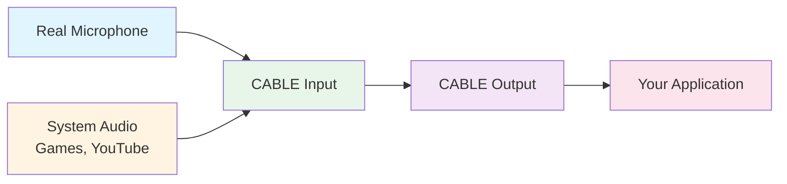
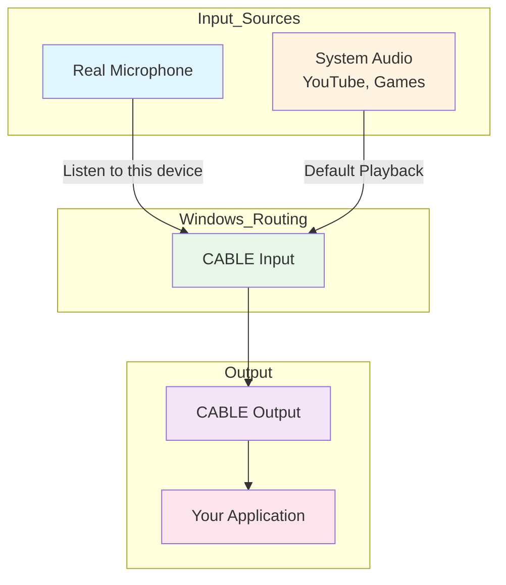
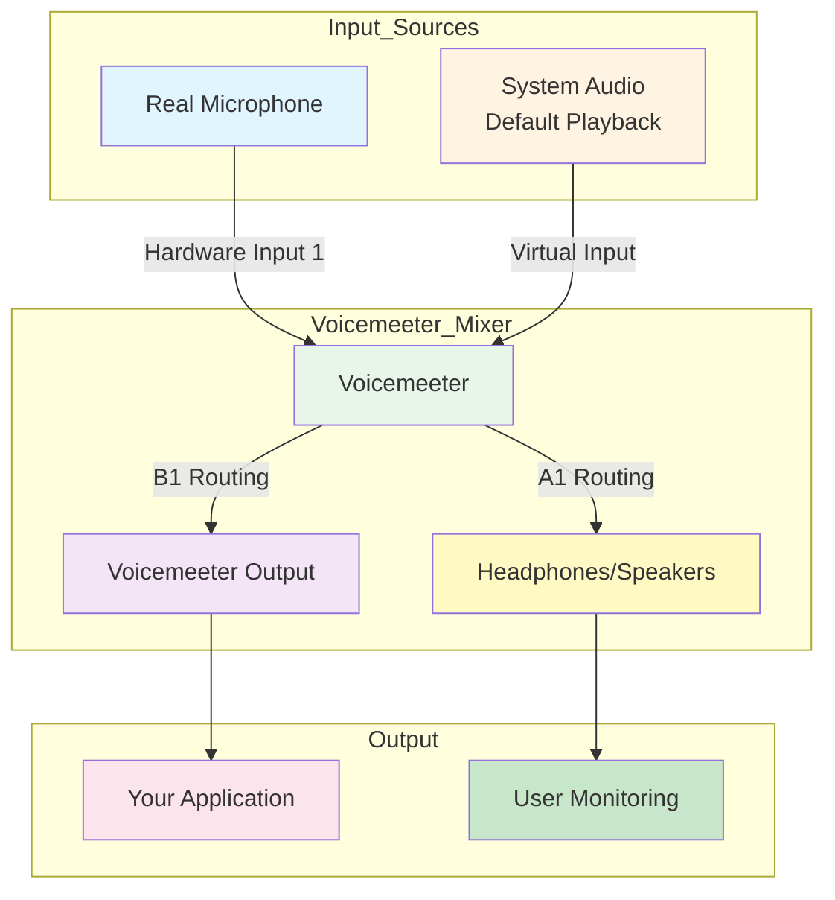

### VB-Audio Virtual Audio Cable

VB-Audio Virtual Audio Cable is a virtual audio device that allows you to route audio between applications. This is particularly useful for:

- **Testing TTS output** without hearing it through your speakers
- **Recording system audio** for testing purposes
- **Audio routing between applications** without physical cables

**Installation:**

1. Download VB-Audio Virtual Audio Cable from [vb-audio.com](https://vb-audio.com/Cable/)
2. Run the installer and follow the on-screen instructions
3. Restart your computer after installation
4. You should see two new audio devices in your Windows sound settings:
   - **CABLE Input (VB-Audio Virtual Cable)** - This acts as a virtual microphone
   - **CABLE Output (VB-Audio Virtual Cable)** - This acts as a virtual speaker

**Configuration:**

1. Open Windows Sound Settings (`Win + I` → System → Sound)
2. Under "Input", you can select "CABLE Input (VB-Audio Virtual Cable)" as your recording device
3. Under "Output", you can select "CABLE Output (VB-Audio Virtual Cable)" as your playback device

**How the App Uses VB-Audio:**

The application uses VB-Audio in two ways:

1. **TTS Output (CABLE Output):**
   - When you enable audio output in `config.json` with `"output_mode": ["popup", "audio"]`
   - The app sends TTS audio to the configured output device
   - If you set `"tts_output_device_name": "CABLE Output (VB-Audio Virtual Cable)"`, the TTS audio will be sent to the virtual cable instead of your speakers
   - This allows you to route the audio to other applications (like recording software) without hearing it yourself

2. **Audio Input (CABLE Input):**
   - When using audio input with `"default_source": "audio"`
   - The app can record from the virtual cable input
   - If you set `"audio_input_device_name": "CABLE Input (VB-Audio Virtual Cable)"`, the app will record audio sent to the virtual cable
   - This is useful for recording system audio or audio from other applications

**Example Configuration:**

```json
{
  "output_mode": ["popup", "audio"],
  "tts_output_device_name": "CABLE Output (VB-Audio Virtual Cable)",
  "audio_input_device_name": "CABLE Input (VB-Audio Virtual Cable)",
  "piper_model": "en_US-lessac-medium.onnx"
}
```

**How Tests Use VB-Audio:**

The test suite uses VB-Audio for automated audio testing:

1. **TTS Testing:**
   - Tests send TTS output to CABLE Output to avoid playing audio during test runs
   - This allows tests to verify TTS functionality without disturbing the user
   - The test configuration typically uses: `"tts_output_device_name": "CABLE Output (VB-Audio Virtual Cable)"`

2. **Audio Recording Testing:**
   - Tests can record from CABLE Input to verify audio capture functionality
   - This allows tests to verify speech recognition without requiring actual microphone input
   - The test configuration typically uses: `"audio_input_device_name": "CABLE Input (VB-Audio Virtual Cable)"`

3. **End-to-End Audio Testing:**
   - Some tests route audio from CABLE Output to CABLE Input to create a complete audio loop
   - This allows testing of the entire audio pipeline (TTS → recording → speech recognition) without external audio hardware
   - This is particularly useful for CI/CD environments and automated testing

**Benefits for Development and Testing:**

- **Silent Testing:** Run audio tests without hearing TTS output
- **Automated Testing:** Enable audio testing in CI/CD environments without physical audio hardware
- **Audio Routing:** Route audio between applications for complex workflows
- **System Audio Recording:** Record audio from any application that can output to CABLE Output

**Troubleshooting:**

- If you don't see the VB-Audio devices, try restarting your computer after installation
- Make sure the VB-Audio driver is properly installed in Windows Device Manager
- If audio isn't routing correctly, check that the correct VB-Audio device is selected in both Windows sound settings and the app configuration
- For testing purposes, you may need to configure your recording software to use CABLE Input as its input source

---

## Multiple Audio Input Sources on Windows

### Overview

When working with real-time transcription or audio processing applications, you may need to capture audio from multiple sources simultaneously. Common scenarios include:

- **Recording both your voice and system audio** (YouTube, games, music) during a session
- **Capturing microphone input alongside application audio** for comprehensive transcription
- **Mixing multiple audio sources** into a single stream for processing

This section explains how to configure Windows to route multiple audio sources into a single virtual cable that your application can consume.

### Understanding Virtual Audio Mixing

Think of **CABLE Input** as a "digital mixing bowl" where you can combine multiple audio sources:



All audio sources routed to CABLE Input get mixed together and emerge as a single stream from CABLE Output, which your Python script can then process.

### Method 1: Windows Native Audio Routing

This method uses built-in Windows audio features to route multiple sources to the virtual cable.

#### Step 1: Route System Audio to Virtual Cable

1. Click the **Speaker Icon** in your Windows taskbar
2. Select **CABLE Input (VB-Audio Virtual Cable)** as your playback device
3. All system audio (YouTube, games, music, etc.) will now flow into the virtual cable

#### Step 2: Route Physical Microphone to Virtual Cable

Since your microphone is an input device, you need to tell Windows to "repeat" its signal into the virtual cable:

1. Open the **Sound Control Panel** by pressing `Win + R` and typing `mmsys.cpl`
2. Navigate to the **Recording** tab
3. Right-click your **Real Microphone** and select **Properties**
4. Go to the **Listen** tab
5. Check the box for **"Listen to this device"**
6. In the "Through this device" dropdown, select **CABLE Input (VB-Audio Virtual Cable)**
7. Click **Apply** and then **OK**

Your microphone audio is now also flowing into the same virtual cable.

#### Step 3: Configure Your Application

Set your application to record from CABLE Output:

```json
{
  "audio_input_device_name": "CABLE Output (VB-Audio Virtual Cable)",
  "default_source": "audio"
}
```

#### Windows Native Audio Flow



#### The "Silent" Problem

**Important Limitation:** With this Windows native method, you won't be able to hear anything through your speakers.

Because you've set your system audio to output to the virtual cable, the sound goes into the "pipe" instead of your actual speakers. If you try to fix this by making CABLE Output "Listen" to your headphones, you'll experience:

- **Audio latency** (delay) that makes it difficult to monitor in real-time
- **Echo effects** from your own voice being played back
- **Poor audio quality** due to Windows' audio processing overhead

### Method 2: Voicemeeter (Recommended)

Voicemeeter is a professional virtual audio mixer created by VB-Audio that solves the limitations of the Windows native method. It provides:

- **Zero-latency monitoring** of mixed audio
- **Professional audio mixing** capabilities
- **Flexible routing** between multiple inputs and outputs
- **Real-time volume control** and audio effects

#### Installation

1. Download Voicemeeter from [vb-audio.com/Voicemeeter](https://vb-audio.com/Voicemeeter/)
2. Choose the version that fits your needs:
   - **Voicemeeter (Standard)** - Basic mixing with 2 hardware inputs, 1 virtual input
   - **Voicemeeter Banana** - Advanced mixing with 3 hardware inputs, 2 virtual inputs
   - **Voicemeeter Potato** - Professional mixing with 5 hardware inputs, 3 virtual inputs
3. Run the installer and restart your computer

#### Configuration

##### Step 1: Set Up Hardware Inputs

1. Open Voicemeeter
2. **Hardware Input 1** (leftmost strip):
   - Click the input name (usually shows "MME")
   - Select your **Real Microphone** from the dropdown
   - Adjust the gain knob if needed

##### Step 2: Set Up Virtual Input

1. **Virtual Input** (middle strip, labeled "B1" or "A1"):
   - This automatically captures your Windows default playback device
   - Set your Windows default playback to your regular speakers/headphones
   - All system audio will now be captured by Voicemeeter

##### Step 3: Configure Audio Routing

Voicemeeter uses routing buttons (A1, A2, A3, B1, B2) to send audio to different outputs:

- **A1, A2, A3**: Hardware outputs (speakers, headphones)
- **B1, B2**: Virtual outputs (virtual cables)

**For your application:**

1. On both **Hardware Input 1** (microphone) and **Virtual Input** (system audio):
   - Click the **B1** button to route both to Virtual Output
   - This sends the mixed audio to the virtual cable

2. On **Hardware Out 1** (or A1):
   - Click the **A1** button on both inputs if you want to hear the mixed audio
   - This sends audio to your physical speakers/headphones for monitoring

##### Step 4: Configure Your Application

Set your application to record from the Voicemeeter virtual output:

```json
{
  "audio_input_device_name": "Voicemeeter Output (VB-Audio Voicemeeter VAIO)",
  "default_source": "audio"
}
```

#### Voicemeeter Audio Flow



#### Advanced Voicemeeter Features

##### Volume Control and Mixing

- Use the **faders** on each input strip to adjust individual volume levels
- Use the **A1** and **B1** buttons to toggle routing on/off
- The **Mono** button can help with phase issues in stereo recordings

##### Audio Effects

- **Gate**: Automatically mutes low-level background noise
- **Compressor**: Evens out volume levels
- **EQ**: Adjust frequency response for better voice clarity

##### Multiple Output Routing

You can send different audio to different outputs:

- **A1**: Your headphones (monitoring)
- **B1**: Your Python application (recording/transcription)
- **B2**: Recording software (OBS, Audacity, etc.)

### Comparison: Windows Native vs Voicemeeter

| Feature | Windows Native | Voicemeeter |
|---------|---------------|-------------|
| **Setup Complexity** | Simple | Moderate |
| **Audio Latency** | High | Low/None |
| **Monitoring** | Poor (echo/delay) | Excellent (real-time) |
| **Audio Quality** | Basic | Professional |
| **Volume Control** | Limited | Full mixing console |
| **Audio Effects** | None | Gate, Compressor, EQ |
| **Multiple Outputs** | Limited | Flexible routing |
| **Resource Usage** | Low | Moderate |

### Troubleshooting Multiple Audio Sources

#### No Audio from Microphone

- Check that the microphone is not muted in Voicemeeter (click the "MUTE" button to unmute)
- Verify the microphone is selected as the input source in Voicemeeter
- Check Windows sound settings to ensure the microphone is not disabled

#### No System Audio

- Ensure your Windows default playback device is set correctly
- In Voicemeeter, check that the Virtual Input is not muted
- Verify that applications are actually outputting audio

#### Audio is Too Quiet

- Increase the gain on individual input strips in Voicemeeter
- Use the **Compressor** effect to boost quiet audio
- Check that your application's input sensitivity is configured correctly

#### Audio Distortion or Clipping

- Reduce the gain on input strips in Voicemeeter
- Use the **Gate** effect to remove background noise
- Check for audio feedback loops (ensure monitoring is set up correctly)

#### High Latency or Echo

- If using Windows native method, switch to Voicemeeter
- In Voicemeeter, ensure you're using **ASIO** or **WDM** drivers instead of MME
- Reduce buffer sizes in Voicemeeter settings (lower = less latency, higher = more stable)

### Use Cases for Multiple Audio Input

#### 1. Gaming Commentary

Capture both your voice commentary and game audio for transcription or streaming:

```
Microphone + Game Audio → Voicemeeter → Transcription/Recording
```

#### 2. Meeting Recording

Record your voice along with screen share audio from video conferencing:

```
Microphone + Meeting Audio → Voicemeeter → Recording
```

#### 3. Content Creation

Combine voice-over with background music or sound effects:

```
Microphone + Music/SFX → Voicemeeter → Final Production
```

#### 4. Accessibility

Transcribe both spoken content and system audio for accessibility features:

```
Voice + System Audio → Voicemeeter → Real-time Transcription
```

### Performance Considerations

- **CPU Usage**: Voicemeeter adds minimal CPU overhead, but complex audio processing may impact performance on older systems
- **Latency**: For real-time transcription, aim for total latency under 100ms
- **Buffer Size**: Lower buffer sizes reduce latency but may cause audio dropouts on slower systems
- **Sample Rate**: Ensure all audio devices use the same sample rate (typically 44.1kHz or 48kHz) to avoid resampling artifacts

### Security and Privacy Notes

- **Audio Monitoring**: Be aware that routing audio to virtual cables makes it accessible to any application with permission
- **Sensitive Content**: Avoid routing sensitive audio (passwords, private conversations) to virtual cables unless necessary
- **Application Permissions**: Review which applications have access to your audio devices in Windows privacy settings
- **Recording Laws**: Be aware of local laws regarding recording conversations, especially when capturing both your voice and others' audio
